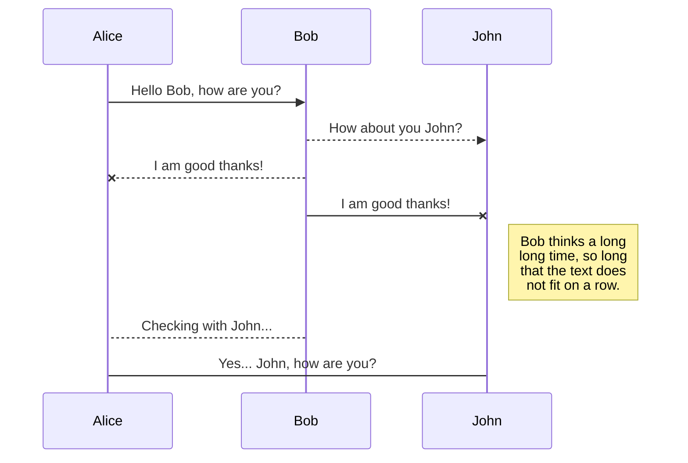
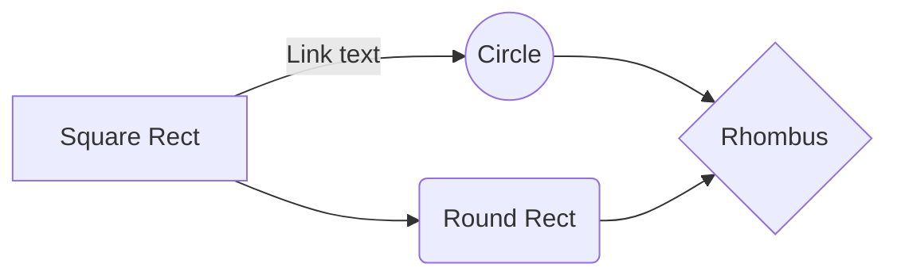

# Proyecto NAME_PROYECTO

Descripción del proyecto...  Lorem ipsum dolor sit amet, consectetur adipiscing elit. Ut feugiat pulvinar accumsan. Aenean in nisi erat. In euismod laoreet felis dapibus varius. Donec vestibulum est sed mauris dictum tincidunt. In finibus orci ut libero scelerisque, eget condimentum neque tincidunt. Vestibulum ornare consequat aliquam. **Quisque eget** sollicitudin turpis, at laoreet nibh. Nunc ac interdum nibh. Mauris luctus, felis quis tempus ultrices, arcu nulla varius augue, vel ornare nisl arcu quis erat. Phasellus tincidunt sed nisl eu pretium. Aliquam erat volutpat. Cras tincidunt sapien sem, in convallis neque ultricies eget. Nulla ipsum massa, tempus in ligula et, ultricies imperdiet ex.
**Historias de usuario**
1. Sed nec urna dapibus, varius neque nec, varius odio. 
2. Duis commodo mattis dolor, eu faucibus lorem feugiat ut. 
3. Nam a ex id arcu scelerisque fringilla at vitae erat. 
4. Ut id nunc mollis dolor sagittis placerat a non nisl. 
5. Ut interdum, odio ac dignissim tempus.

## HU1: Crear algo_

Descripción

Colocas un enlace: 
Figma [HU1: Mi historia de usuario](http://www.figma.com/)

O una imagen: 

O una imagen con link

## OTROS EJEMPLOS DE SINTAXIS EN MARKDOWN

## SmartyPants

SmartyPants converts ASCII punctuation characters into "smart" typographic punctuation HTML entities. For example:

|                |ASCII                          |HTML                         |
|----------------|-------------------------------|-----------------------------|
|Single backticks|`'Isn't this fun?'`            |'Isn't this fun?'            |
|Quotes          |`"Isn't this fun?"`            |"Isn't this fun?"            |
|Dashes          |`-- is en-dash, --- is em-dash`|-- is en-dash, --- is em-dash|

## KaTeX

You can render LaTeX mathematical expressions using [KaTeX](https://khan.github.io/KaTeX/):

The *Gamma function* satisfying $\Gamma(n) = (n-1)!\quad\forall n\in\mathbb N$ is via the Euler integral

$$
\Gamma(z) = \int_0^\infty t^{z-1}e^{-t}dt\,.
$$

> You can find more information about **LaTeX** mathematical expressions [here](http://meta.math.stackexchange.com/questions/5020/mathjax-basic-tutorial-and-quick-reference).

## UML diagrams

You can render UML diagrams using [Mermaid](https://mermaidjs.github.io/). For example, this will produce a sequence diagram:

And this will produce a flow chart:

